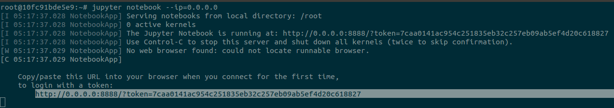
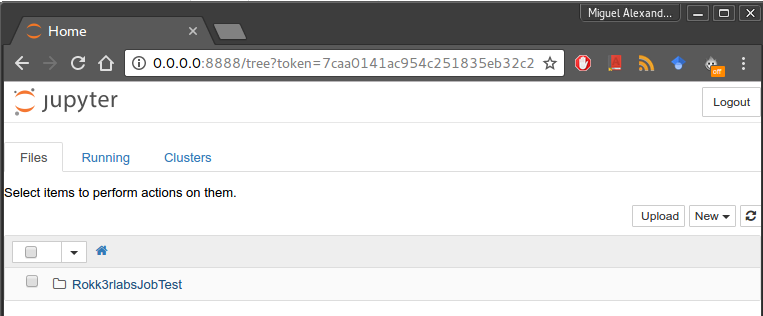
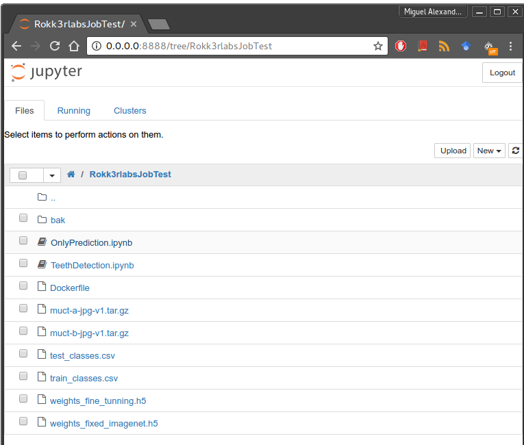
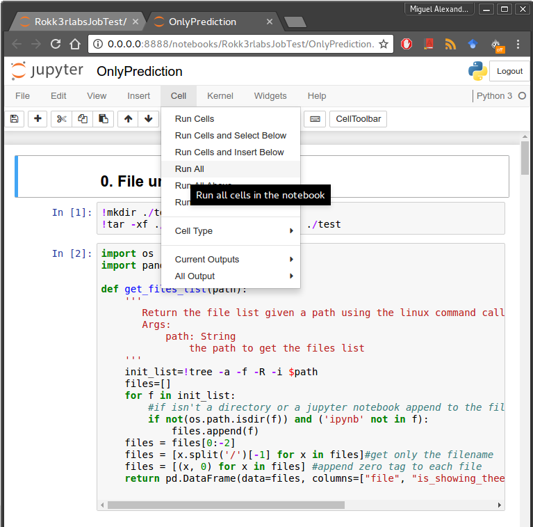
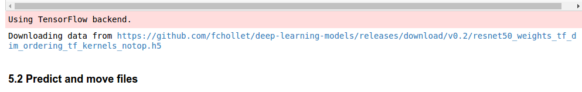

## How to build the docker?
In a bash terminal run the following command, note that *Dockerfile* is the path to the Dockerfile in your computer.
```{r, engine='bash', count_lines}
sudo docker build -f Dockerfile -t jobtest:1.0 . 
```
## How to run the docker?

```{r, engine='bash', count_lines}
sudo docker run -p 8888:8888 -it jobtest:1.0
```
## How run the examples?
* Initialize the [jupyter server](http://jupyter.org/)
```{r, engine='bash', count_lines}
jupyter notebook --ip=0.0.0.0
```
* Copy the url generated into the browser 


* Then you will see this GUI interface, and the content of this repository ready to run


* Open the folder **Rokk3rlabsJobTest** there you will find all the files, included the two notebooks files.

  * **TeethDetection.ipynb** This notebook runs the entire project, but you should be aware the training process will take several ours to end, due all the training process will begin from scratch.
  * **OnlyPrediction.ipynb** This notebook runs only the prediction phase, using the "optimal" weights finded previously that are included in this repository, run this file is strongly recommended over the previous one.


* To run any notebook just click on the *cell* menu, then select the *Run All* option.


* Just be patient while the descriptors of the network downloads, and the network processes the images. A message like this will appear 


* The expected results of the notebooks should be like the following:
  * [TeethDetection.ipynb](https://github.com/miguelalexanderdiaz/Rokk3rlabsJobTest/blob/master/TeethDetection.ipynb)
  * [OnlyPrediction.ipynb](https://github.com/miguelalexanderdiaz/Rokk3rlabsJobTest/blob/master/OnlyPrediction.ipynb)

## Notes:
* The docker only supports parallel processing through CPU.
* If you don't have enought time, run the notebook **OnlyPrediction.ipynb**
